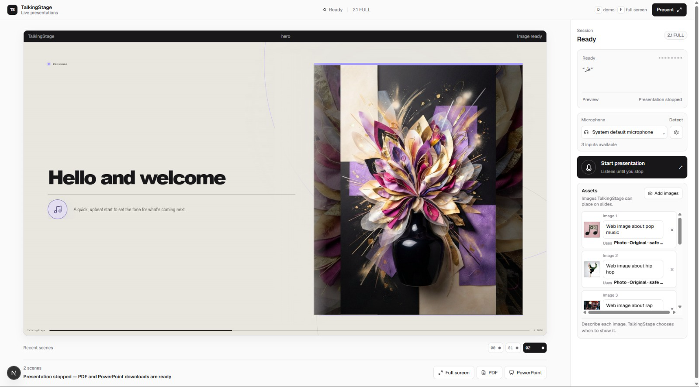
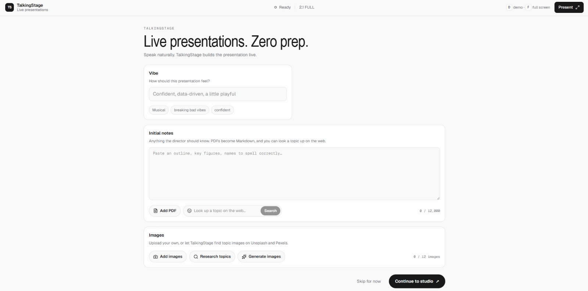

# 🎙️ TalkingStage

> **Live presentations. Zero prep.**  
> *Speak naturally. TalkingStage listens, directs, and builds a presentation deck live in real time.*

[](https://nextjs.org/)
[](https://react.dev/)
[](https://www.typescriptlang.org/)
[](https://tailwindcss.com/)
[](https://webrtc.org/)
[](https://ai.google.dev/)
[](https://www.sarvam.ai/)
[](LICENSE)
[](https://nodejs.org/)

---

## 🖼️ Application Preview

### 1. Live Presentation Studio
*The real-time presentation canvas dynamically rendering slides, contextual AI-generated imagery, live audio waveform, and multi-format exports as you speak.*



### 2. Pre-Session Setup & Briefing Intelligence
*Configure presentation vibe presets, ingest PDF briefing notes via Document AI, conduct web research, and curate topic imagery before stepping up to speak.*



---

## 📖 Overview

**TalkingStage** is an autonomous, voice-directed live presentation director. Instead of spending hours building static slide decks before a meeting, you simply speak. TalkingStage listens to your natural voice over ultra-low-latency WebRTC, detects semantic shifts, structures your narrative into clean visual scenes, semantically selects relevant imagery and assets, generates cinematic contextual backgrounds on the fly, and exports the final presentation into high-fidelity PDF and PowerPoint decks.

Whether pitching to investors, delivering a technical deep dive, leading a board meeting, or running a brainstorm, TalkingStage turns spontaneous conversation into an interactive presentation.

---

## ✨ Key Features

### 🎬 Real-Time AI Presentation Director
- **Zero-Latency Voice Director**: Streams microphone audio over WebRTC to a high-speed live director engine with server-side Voice Activity Detection (VAD) and far-field noise suppression.
- **Dynamic Visual Decisions**: The AI director decides the layout and cadence on every turn via the `stage_visuals` decision engine:
  - `replace`: Launches a brand-new semantic scene/beat.
  - `merge_cards`: Progressively expands and evolves a multi-point list in place.
  - `focus`: Highlights, refines, or adds detail to the active concept.
  - `hold`: Suppresses updates during background noise or repetitions.
- **High-Sensitivity Live Composition**: Recomposes visual grammar every 2–3 substantive turns so the stage stays dynamic, structured, and visually engaging.

### 🛡️ Resilient Dual-Engine Speech Transcription
- **Primary Live STT**: Streaming real-time speech-to-text directly inside the WebRTC session.
- **Sarvam AI Realtime Fallback**: An in-browser `AudioWorkletProcessor` converts microphone audio to 16 kHz 16-bit mono PCM (`linear16`). If the primary transcription is delayed, empty, or fails, the stream routes seamlessly to Sarvam AI (`saaras:v3-realtime`) WebSocket for instant transcript recovery.

### 🎨 Intelligent Visual Grammar & Dynamic Diagrams
- **4 Expressive Scene Archetypes**:
  - **`Hero`**: Bold thesis statement paired with an editorial visual panel.
  - **`Cards`**: 2 to 4 sibling ideas with automated SVG diagram connectors and distinct icons.
  - **`Metric`**: Giant focal numbers paired with real-world conceptual visual metaphors.
  - **`Quote`**: High-impact pull quotes with source/speaker attribution.
  - **`Cover`**: Editorial branded intro scene that transitions away on your first substantive words.
- **119 Semantic Icons**: Integrated catalog of [Lucide](https://lucide.dev/) icons across business, healthcare, science, engineering, finance, travel, and cloud computing.
- **4 Vibrant Accent Palettes**: `Ember` (orange-red), `Lime` (acid green), `Sky` (cyan blue), and `Violet` (luminous violet).

### 🖼️ Real-Time & Reference-Conditioned Imagery
- **Gemini Live Backgrounds**: Google Gemini (`gemini-3.1-flash-lite-image`) creates 16:9 cinematic, editorial-quality photography tailored specifically to the live speech topic with no text/watermarks.
- **Multimodal Style Conditioning**: Upload style references or moodboards to condition Gemini's generative atmosphere while preserving brand fidelity.
- **Pre-Session Batch Generation**: Synthesizes photographic assets ahead of time based on initial briefing notes using Gemini (`gemini-3.5-flash-lite` prompt engineer + fast image rendering).

### 🗂️ Smart Presentation Asset Manager
- **Categorized Ingestion**: Supports 7 semantic asset kinds: `person`, `logo`, `product`, `screenshot`, `chart`, `photo`, and `illustration`.
- **Direct Mode**: Renders original, un-distorted brand logos, product interfaces, team headshots, and charts with automatic aspect ratio hints (`tall`, `portrait`, `square`, `landscape`, `wide`).
- **Reference Mode**: Routes illustrative/background images as generative style seeds to Gemini.
- **Semantic Asset Ranking**: Automatically scores and maps uploaded assets to live speech context without requiring the speaker to recite filenames.

### ⚡ Pre-Session Setup & Briefing Intelligence
- **Persistent Vibe Engine**: Save and reuse tone descriptors (e.g., *"Confident, data-driven, a little playful"*, *"Visionary Keynote"*, *"Technical Architecture"*) powered by Node 22's built-in SQLite (`DatabaseSync`).
- **Sarvam Document AI PDF Ingestion**: Upload briefing PDFs up to 60 pages; automatically chunks, digitizes, and extracts structured Markdown via Sarvam OCR.
- **Live Web Research**: Live web search tool writes concise, fact-checked briefing bullets with citations automatically extracted.
- **Anakin Web Scraper**: Discovers topic tags and scrapes high-resolution stock photography (Unsplash, Pexels) and Wikipedia context directly into the presentation library.

### 🚀 Live Stage Controls & Instant Multi-Format Export
- **Live Scrubber & Filmstrip**: Jump between past scenes, edit copy inline, or add manual cards.
- **Fullscreen Stage Mode**: Toggle immersive projection with keyboard shortcut (`F`).
- **Offline / Local Fallback**: Full interactive demo script and typed-line composer ready out of the box even without API keys.
- **1-Click High-Res Export**:
  - **PDF**: Generated at 1600×900 resolution via `jspdf` and `html-to-image`.
  - **PPTX**: 16:9 widescreen presentation export with structured metadata via `pptxgenjs`.

---

## 🏛️ System Architecture

```
                                  +---------------------------------------+
                                  |         Presenter Microphone          |
                                  +---------------------------------------+
                                       |                             |
                                 WebRTC Audio                   AudioWorklet
                                       |                       (16kHz PCM16)
                                       v                             |
                    +-------------------------------------+          v
                    |     Live Voice Director Session     |   +--------------+
                    |    (WebRTC Low-Latency Director)    |   |  Sarvam AI   |
                    +-------------------------------------+   | (saaras:v3)  |
                                       |                      +--------------+
                             stage_visuals Tool                      |
                            (replace/merge/focus)              Fallback STT
                                       |                             |
                                       +--------------+--------------+
                                                      |
                                                      v
                                      +-------------------------------+
                                      |     Live Stage Orchestrator   |
                                      |   (React 19 / Next.js 16)     |
                                      +-------------------------------+
                                         |            |             |
                         +---------------+            |             +---------------+
                         |                            |                             |
                         v                            v                             v
           +---------------------------+  +------------------------+  +---------------------------+
           |       Google Gemini       |  |  Asset Matching Engine |  |    Local State & Canvas   |
           | (gemini-3.1-flash-lite)   |  | (Direct vs Reference)  |  |  (Lucide / SVG Diagrams)  |
           |  Per-scene 16:9 imagery   |  +------------------------+  +---------------------------+
           +---------------------------+              |                             |
                         |                            v                             v
                         +-------------------> Presentation Stage <-----------------+
                                                      |
                                                      v
                                        +----------------------------+
                                        |    Export Engine (16:9)    |
                                        |  - PDF Export (jspdf)      |
                                        |  - PPTX Export (pptxgenjs) |
                                        +----------------------------+
```

---

## 🛠️ Tech Stack

| Domain | Technology | Purpose |
| :--- | :--- | :--- |
| **Framework** | [Next.js 16 (Turbopack)](https://nextjs.org/) | App Router, Server Actions, API Routes, Streaming |
| **UI & Styling** | [React 19](https://react.dev/) + [Tailwind CSS v4](https://tailwindcss.com/) | Real-time reactive stage, design tokens, responsive layout |
| **Icons & Visuals** | [Lucide React](https://lucide.dev/) (119 icons) | Dynamic semantic diagramming and card iconography |
| **Live Voice & VAD** | [WebRTC Voice Engine](https://webrtc.org/) | Real-time WebRTC audio director and primary transcription |
| **Speech Fallback** | [Sarvam AI](https://www.sarvam.ai/) (`saaras:v3-realtime`) | WebSocket fallback speech-to-text with PCM audio tap |
| **Document AI** | [Sarvam AI Doc AI](https://www.sarvam.ai/) | PDF digitization and structured Markdown extraction |
| **Generative Imagery** | [Google Gemini](https://ai.google.dev/) (`gemini-3.1-flash-lite-image`) | Real-time contextual 16:9 photography and moodboard conditioning |
| **Web Research** | [Web Search Tools](https://platform.openai.com/) + [Anakin](https://anakin.io/) | Live web search, topic extraction, and stock photo scraping |
| **Local Storage** | [Node.js 22 SQLite](https://nodejs.org/api/sqlite.html) (`DatabaseSync`) | Zero-dependency local persistence for presentation vibes |
| **Export Engines** | [jspdf](https://github.com/parallax/jsPDF) + [pptxgenjs](https://gitbrent.github.io/PptxGenJS/) + [html-to-image](https://github.com/bubkoo/html-to-image) | Vector & raster 16:9 PDF and editable PowerPoint export |

---

## 📂 Project Structure

```
TalkingStage/
├── app/
│   ├── api/
│   │   ├── imagery/
│   │   │   ├── route.ts             # Per-scene Gemini background generation
│   │   │   └── generate/route.ts    # Pre-session batch image generator from notes
│   │   ├── notes/
│   │   │   ├── pdf/route.ts         # Sarvam Document AI PDF digitization
│   │   │   └── search/route.ts      # Web search for briefing notes
│   │   ├── realtime/route.ts        # WebRTC live director session minting
│   │   ├── research/route.ts        # Anakin URL scraper for photos & Wikipedia
│   │   ├── tags/route.ts            # Topic tag extractor
│   │   ├── transcribe/route.ts      # Sarvam AI fallback STT WebSocket bridge
│   │   └── vibes/route.ts           # SQLite vibe persistence API
│   ├── globals.css                  # Custom design tokens, animations, and stage styling
│   ├── layout.tsx                   # Root HTML layout with dynamic metadata
│   └── page.tsx                     # Main interactive stage, audio worklet, & export UI
├── config/
│   ├── brand.json                   # Brand identity, promise, and category
│   └── v1.json .. v7.json           # Versioned configurations and model parameters
├── public/
│   ├── screenshots/                 # High-resolution application screenshots
│   └── favicon.svg                  # Brand favicon & SVGs
│   ├── anakin.ts                    # Anakin scraper integration & URL builders
│   ├── iconography.ts               # Semantic Lucide icon vocabulary
│   ├── pcm.ts                       # Float32 to linear16 PCM conversion helpers
│   ├── presentation-assets.ts       # Semantic asset ranking, catalog encoding, & fit logic
│   ├── realtime-models.ts           # Supported voice director models
│   ├── request-guards.ts            # Rate limiting & cross-origin security guards
│   └── vibes.ts                     # Native Node 22 SQLite vibe store
├── public/                          # Favicons, SVGs, and brand assets
├── tests/                           # Node test runner suite (160+ unit & integration tests)
├── .env.example                     # Environment variable blueprint
├── LICENSE                          # MIT Open Source License
├── next.config.ts                   # Next.js & Turbopack bundle configuration
├── package.json                     # Dependencies and run scripts
└── tsconfig.json                    # TypeScript configuration
```

---

## ⚡ Getting Started

### Prerequisites
- **Node.js**: `v22.13.0` or higher (utilizes native `node:sqlite` and global `WebSocket`)
- **Package Manager**: `pnpm` (recommended), `npm`, or `yarn`

### 1. Clone & Install

```bash
git clone https://github.com/rajarshidattapy/TalkingStage.git
cd TalkingStage
pnpm install
```

### 2. Configure Environment Variables

Create a `.env.local` file from the example:

```bash
cp .env.example .env.local
```

Populate the API keys:

```ini
# Live Voice Director & Web Search (Required for live voice)
OPENAI_API_KEY=sk-...

# Real-Time Contextual Image Generation (Required for generative slide backgrounds)
GEMINI_API_KEY=AIzaSy...

# Fallback STT & PDF Digitization (Optional but recommended)
SARVAM_API_KEY=...

# Web Research & Stock Image Scraping (Optional)
ANAKIN_API_KEY=...
```

> **Note**: If you run without API keys, TalkingStage automatically boots into **Local Demo Mode**, allowing you to test scripted scenarios, manual typing, and exports without any external costs.

### 3. Run Development Server

```bash
pnpm dev
```

Open [http://localhost:3000](http://localhost:3000) in your browser.

### 4. Run Test Suite

```bash
node --test tests/*.test.mjs
```

---

## 🔌 API Endpoints Reference

| Endpoint | Method | Description |
| :--- | :--- | :--- |
| `/api/realtime` | `POST` | Mints WebRTC SDP session with Live Voice Director and configures tools. |
| `/api/transcribe` | `POST` | Streams 16 kHz PCM audio to Sarvam AI WebSocket fallback transcription. |
| `/api/imagery` | `POST` | Generates a 16:9 Gemini background image for the current scene. |
| `/api/imagery/generate` | `POST` | Generates a batch of illustrative photographs from briefing notes. |
| `/api/notes/pdf` | `POST` | Uploads a PDF to Sarvam Document AI and returns Markdown. |
| `/api/notes/search` | `POST` | Searches the web and returns bulleted briefing notes with citations. |
| `/api/research` | `POST` | Uses Anakin to scrape stock photos and Wikipedia articles for topic tags. |
| `/api/tags` | `POST` | Extracts 1–3 word searchable topic tags from tone and notes. |
| `/api/vibes` | `GET` / `POST` | Retrieves or persists presentation vibe presets in SQLite. |

---

## ⌨️ Shortcuts & Controls

- **`F`**: Toggle Fullscreen presentation mode.
- **`Space / Enter`** (in composer): Submit a typed line to stage an idea manually.
- **`Esc`**: Exit Fullscreen or dismiss modal overlays.
- **Timeline / Filmstrip**: Click any past slide thumbnail to scrub back and inspect previous scenes.
- **Export Menu**: Download the generated deck as PDF or PPTX at any time during or after the talk.

---

## 🔒 Security & Guardrails

- **Origin Verification**: All sensitive POST endpoints reject mismatched cross-origin requests (`hasMismatchedOrigin`).
- **Granular Rate Limiting**: In-memory rate limiting per client IP and endpoint scope with standard `Retry-After` and `X-RateLimit-*` headers.
- **Strict Data Envelopes**: Briefing notes and user assets are isolated as data blocks in prompts to prevent prompt injection.
- **Strict Schemas**: Director function calls and topic tags are bound by strict JSON schemas.

---

## 📄 Licensing & Open Source

This project is licensed under the **MIT License**.

```text
MIT License

Copyright (c) 2026 TalkingStage Contributors

Permission is hereby granted, free of charge, to any person obtaining a copy
of this software and associated documentation files (the "Software"), to deal
in the Software without restriction, including without limitation the rights
to use, copy, modify, merge, publish, distribute, sublicense, and/or sell
copies of the Software, and to permit persons to whom the Software is
furnished to do so, subject to the following conditions:

The above copyright notice and this permission notice shall be included in all
copies or substantial portions of the Software.

THE SOFTWARE IS PROVIDED "AS IS", WITHOUT WARRANTY OF ANY KIND, EXPRESS OR
IMPLIED, INCLUDING BUT NOT LIMITED TO THE WARRANTIES OF MERCHANTABILITY,
FITNESS FOR A PARTICULAR PURPOSE AND NONINFRINGEMENT. IN NO EVENT SHALL THE
AUTHORS OR COPYRIGHT HOLDERS BE LIABLE FOR ANY CLAIM, DAMAGES OR OTHER
LIABILITY, WHETHER IN AN ACTION OF CONTRACT, TORT OR OTHERWISE, ARISING FROM,
OUT OF OR IN CONNECTION WITH THE SOFTWARE OR THE USE OR OTHER DEALINGS IN THE
SOFTWARE.
```
